# 📊 Retail Sales Data Analysis & Business Intelligence

[](https://www.python.org/)
[](https://pandas.pydata.org/)
[](https://seaborn.pydata.org/)
[](https://jupyter.org/)
[](https://opensource.org/licenses/MIT)

An end-to-end data analytics and business intelligence project demonstrating the processing, cleaning, and advanced exploratory analysis of transactional retail records. Using a dataset spanning over **11,000 retail transactions (2022–2025)**, this repository implements a comprehensive data engineering and analysis pipeline in Python to generate high-impact business insights, behavioral analysis, and trend reporting.

---

## 🗺️ Project Workflow Diagram

The flowchart below represents the data engineering pipeline, statistical transformation, and analytical process executed within the project:

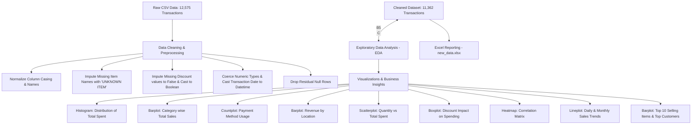

---

## 📂 Project Repository Structure

To maintain a professional, standard codebase suitable for enterprise deployment, the files are laid out in a clear, modular structure:

```
├── data/
│   ├── retail_store_sales.csv         # Raw transactional dataset (11,000+ records)
│   └── new_data.xlsx                  # Cleaned, standardized dataset exported for BI tools
├── notebooks/
│   └── data.ipynb                     # Primary Jupyter Notebook containing ETL & visual EDA
├── .gitignore                         # Standard ignore rules for Python/Jupyter environments
├── requirements.txt                   # Dependency manifests with strict version boundaries
└── README.md                          # Comprehensive project documentation
```

---

## 📈 Executive Project Overview

For modern retail firms, operational excellence and customer retention depend heavily on data-backed decision-making. This project delivers a complete business intelligence pipeline that digests transaction-level retail registers, cleans corrupted records, resolves missing values, and processes statistical aggregates.

### Key Performance Indicators (KPIs) Captured:
* **Total Cleaned Transactions**: 11,362 records (retaining 90.3% of raw data).
* **Total Generated Sales Revenue**: **$1,472,998.50** (approx. $1.47 Million).
* **Average Transaction Basket Value**: **$129.64**.
* **Primary Sales Channels**: Highly balanced across locations, with **Online Sales** representing **$749,431.00** (50.9%) and **In-store Sales** contributing **$723,567.50** (49.1%).
* **Primary Payment Methods**: Highly diversified usage among **Cash** (3,917), **Credit Card** (3,729), and **Digital Wallet** (3,716).

---

## 🎯 Project Objectives

1. **Robust ETL Implementation**: Establish a reliable Python pipeline utilizing Pandas to process multi-format records, handle invalid strings, standardize columns, and normalize date formats.
2. **Missing Value Imputation**: Design standard rules for missing feature handling without distorting downstream statistics.
3. **Exploratory Data Analysis (EDA)**: Leverage Seaborn and Matplotlib to analyze purchasing trends, demographic clusters, seasonal cycles, and product preferences.
4. **Behavioral Analysis**: Correlate purchase sizes, pricing structures, and transaction locations with and without discounts.
5. **Business Intelligence Reporting**: Structure and export structured excel data files (`new_data.xlsx`) for direct consumption by BI dashboards (PowerBI/Tableau).

---

## 📋 Dataset Profile & Schema

The dataset contains transaction-level retail metadata collected between **January 1, 2022, and January 18, 2025**. 

| Column Name | Data Type | Description |
| :--- | :--- | :--- |
| **Transaction_id** | `object` | Globally Unique Identifier (UUID) for each transaction. |
| **Customer_id** | `object` | Identifier tracking returning customer profiles. |
| **Category** | `object` | Top-level product division (e.g., Patisserie, Milk Products, Butchers). |
| **Item** | `object` | Specific product naming tag. |
| **Price_per_unit** | `float64` | Pricing per unit item (USD). |
| **Quantity** | `float64` | Item count in transaction basket. |
| **Total_spent** | `float64` | Total monetary spend for transaction (USD). |
| **Payment_method** | `object` | Customer transaction payment choice (Cash, Credit Card, Digital Wallet). |
| **Location** | `object` | Purchase acquisition channel (Online vs. In-store). |
| **Transaction_date**| `datetime64[ns]`| Timestamp tracking transaction time. |
| **Discount_applied**| `bool` | Flag tracking if a promotion was active during purchase. |

---

## 🧹 Data Cleaning & Preprocessing Pipeline

The primary notebook executes a highly controlled cleaning process to ensure zero data leakage or analytical distortion:

1. **Column Normalization**: Raw column headers are stripped of whitespace, cast to lowercase, and space-spaced characters are replaced with underscores (`_`). Finally, headers are formatted to a capital case for professional export.
2. **Date Alignment**: The transaction date strings are parsed into standardized `datetime64[ns]` formats. Invalid dates are coerced into `NaT` (Not-a-Time).
3. **Imputation of Missing Items**: Missing strings in the product column `Item` are resolved to `"UNKNOWN ITEM"` to maintain record continuity.
4. **Imputation & Casting of Discount Flags**: Null records in the boolean column `Discount_applied` are filled with `False` and the array is cast to a strict `bool` format.
5. **Coercion of Numeric Variables**: Fields such as `Price_per_unit`, `Quantity`, and `Total_spent` are cast to double-precision floats. Values failing parsing are coerced to `NaN`.
6. **Integrity-Preserving Drop**: Residual rows containing null references in essential numeric columns (which represented less than 9.7% of the raw data) are safely dropped to ensure perfect visualization calculations.

---

## 🔍 Exploratory Data Analysis (EDA) Process

The project conducts a thorough analysis across multiple business vectors:
* **Univariate Distributions**: Analysis of spend density to locate extreme outliers and typical purchase baskets.
* **Bivariate Performance Analysis**: Sales breakdowns cross-referencing sales categories, acquisition locations, and payment modes.
* **Correlation Studies**: Determining dependencies between per-unit prices, purchasing baskets, and transaction amounts.
* **Trend Analysis**: Mapping seasonal behavior patterns, month-over-month performance trends, and overall sales trends.

---

## 🎨 Visualization Directory

Thirteen highly polished charts were created to extract visual business intelligence from the transaction records:

### 1. Purchase Distribution Analysis
* **Chart Type**: Histogram with Kernel Density Estimate (KDE).
* **Plotting Code**: `sns.histplot(df['Total_spent'], bins=30, kde=True)`
* **Analytical Value**: Highlights purchase frequencies across monetary thresholds, showing a right-skewed purchasing density pattern.
* **Screenshot Placeholder**: 
  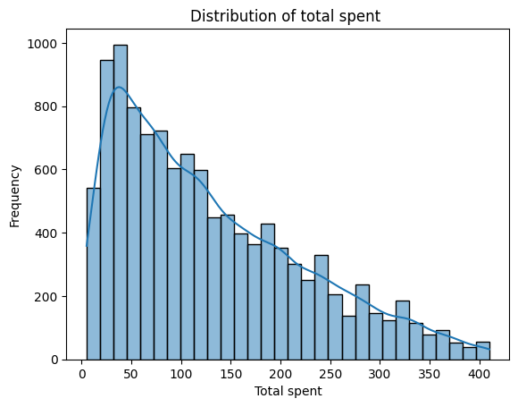

### 2. Category Revenue Performance
* **Chart Type**: Vertical Bar Plot (Sum Estimator).
* **Plotting Code**: `sns.barplot(x='Category', y='Total_spent', data=df, estimator=sum)`
* **Analytical Value**: Identifies top product divisions by sales volume. *Butchers* ($197,426.00) and *Electric Essentials* ($192,441.50) emerge as top performers.
* **Screenshot Placeholder**: 
  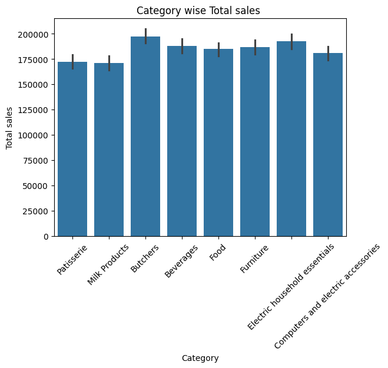

### 3. Payment Method Popularity
* **Chart Type**: Count Plot.
* **Plotting Code**: `sns.countplot(x='Payment_method', data=df)`
* **Analytical Value**: Measures the transaction counts of diverse payment methods, showing an almost equal 3-way split among Cash (3,917), Credit Cards (3,729), and Digital Wallets (3,716).
* **Screenshot Placeholder**: 
  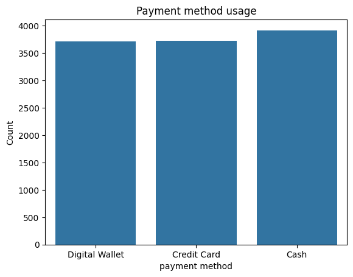

### 4. Sales Distribution by Location
* **Chart Type**: Vertical Bar Plot (Sum Estimator).
* **Plotting Code**: `sns.barplot(x='Location', y='Total_spent', data=df, estimator=sum)`
* **Analytical Value**: Assesses channel performance. Shows Online revenue slightly leading at $749,431.00 compared to In-store sales at $723,567.50.
* **Screenshot Placeholder**: 
  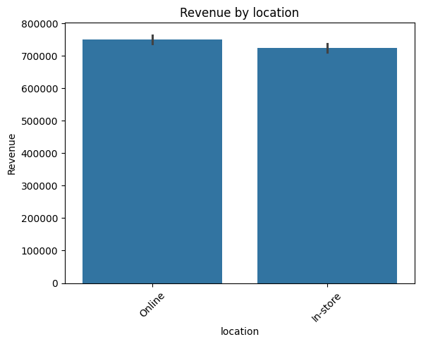

### 5. Quantity vs. Spending Behavior
* **Chart Type**: Scatter Plot (Hue Categorized).
* **Plotting Code**: `sns.scatterplot(x='Quantity', y='Total_spent', hue='Category', data=df)`
* **Analytical Value**: Displays transaction distribution patterns by quantity purchased, segmented by product groups.
* **Screenshot Placeholder**: 
  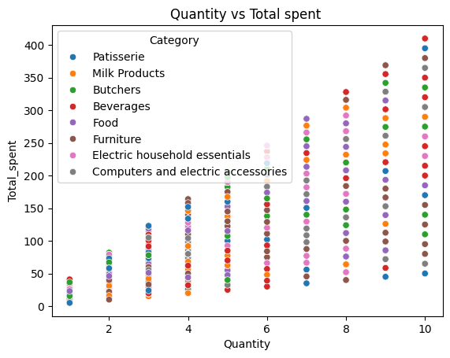

### 6. Discount Impact Evaluation
* **Chart Type**: Box Plot.
* **Plotting Code**: `sns.boxplot(x='Discount_applied', y='Total_spent', data=df)`
* **Analytical Value**: Compares purchase distributions. Promoted baskets exhibit a slightly higher average spent ($130.72) vs. unpromoted baskets ($129.10).
* **Screenshot Placeholder**: 
  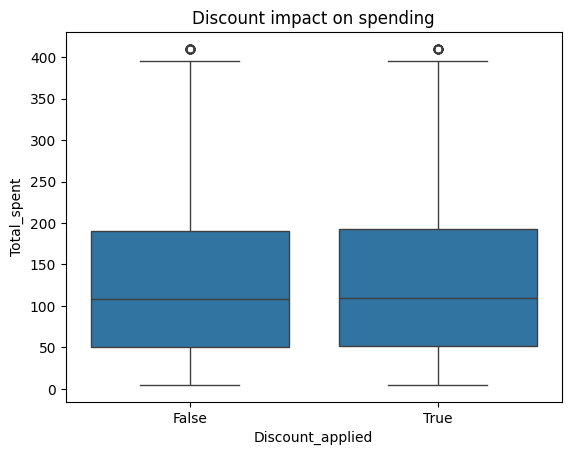

### 7. Correlation Heatmap
* **Chart Type**: Heatmap Matrix (Annotated).
* **Plotting Code**: `sns.heatmap(corr, annot=True, cmap='coolwarm')`
* **Analytical Value**: Quantifies internal relationships between pricing, volume, and total sales.
* **Screenshot Placeholder**: 
  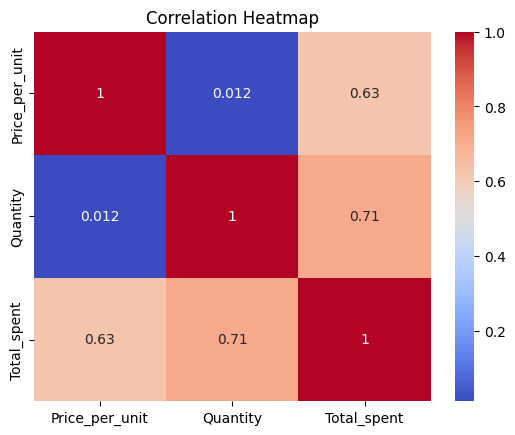

### 8. Daily Sales Trend
* **Chart Type**: Line Plot.
* **Plotting Code**: `sns.lineplot(x='Transaction_date', y='Total_spent', data=daily_sales)`
* **Analytical Value**: Tracks day-to-day cash flow patterns to capture operational cycles and seasonal anomalies.
* **Screenshot Placeholder**: 
  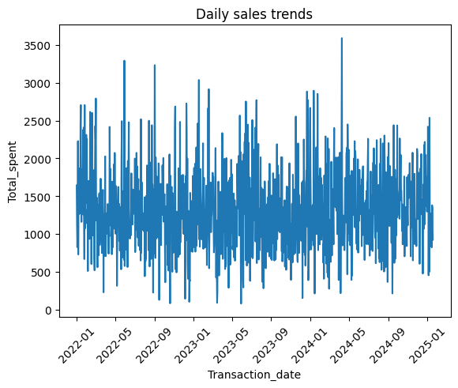

### 9. Top 10 High-Demand Products
* **Chart Type**: Horizontal Bar Plot.
* **Plotting Code**: `sns.barplot(x=top_items.values, y=top_items.index)`
* **Analytical Value**: Details the top 10 products by quantity sold, highlighting inventory priorities.
* **Screenshot Placeholder**: 
  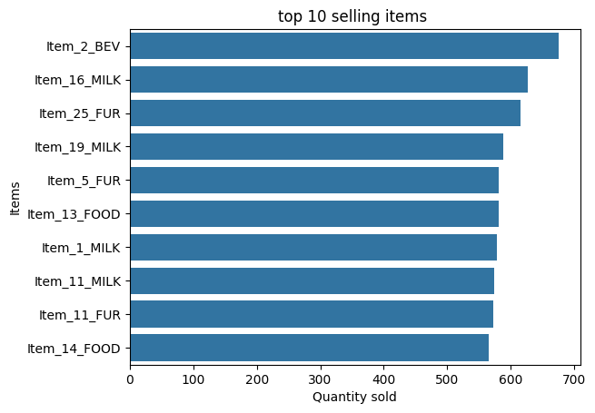

### 10. Multi-Feature Pairplot
* **Chart Type**: Pair Plot.
* **Plotting Code**: `sns.pairplot(df[['Price_per_unit', 'Quantity','Total_spent']])`
* **Analytical Value**: Provides a grid representation of distributions and scatter variations across numeric dimensions.
* **Screenshot Placeholder**: 
  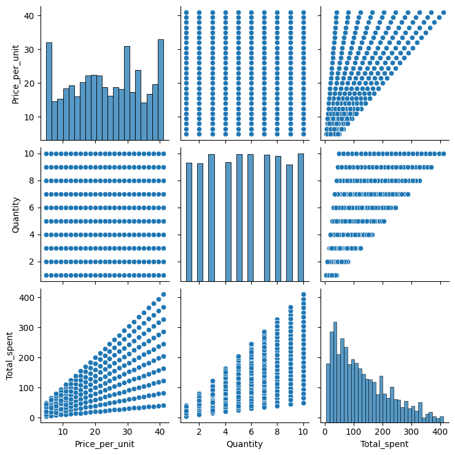

### 11. Month-over-Month Growth Analysis
* **Chart Type**: Line Plot with Markers.
* **Plotting Code**: `sns.lineplot(x='Month', y='Total_spent', data=monthly_sales, marker='o')`
* **Analytical Value**: Aggregates sales by month to highlight seasonal cycles and growth trends.
* **Screenshot Placeholder**: 
  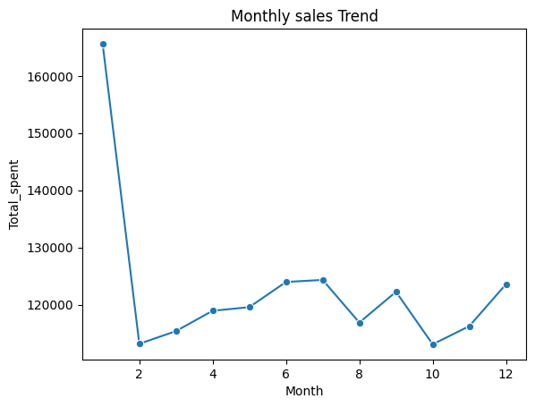

### 12. Transaction Density per Category
* **Chart Type**: Sorted Count Plot.
* **Plotting Code**: `sns.countplot(y='Category', data=df, order=df['Category'].value_counts().index)`
* **Analytical Value**: Shows total transaction counts per category, ordered descending.
* **Screenshot Placeholder**: 
  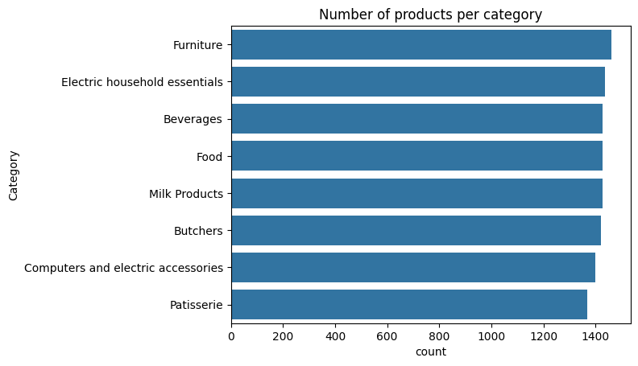

### 13. Top 10 Customer Spending Profiles
* **Chart Type**: Horizontal Bar Plot.
* **Plotting Code**: `sns.barplot(x=customer_spending.values, y=customer_spending.index)`
* **Analytical Value**: Identifies the top 10 customer accounts by total revenue contribution to support targeted CRM loyalty programs.
* **Screenshot Placeholder**: 
  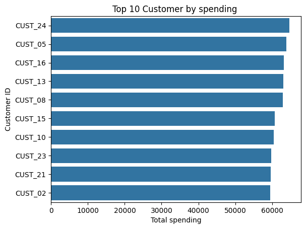

---

## 💡 Key Business Insights

* **Balanced Channel Performance**: The narrow gap between Online ($749k) and In-store ($723k) revenue indicates a strong omni-channel presence. Marketing efforts should sustain both channels.
* **Unified Payment Preferences**: Customers use Cash, Credit Cards, and Digital Wallets almost equally. This shows the importance of maintaining a payment infrastructure that supports multiple modes.
* **Promotional Performance**: Discount campaigns do not drastically change average purchase quantities (averaging ~5.5 items per transaction in both categories), but they drive a slight increase in average ticket size ($130.72 with discounts vs $129.10 without). This indicates promotions may nudge customers toward slightly higher-value items.
* **Revenue Drivers**: *Butchers*, *Electric Household Essentials*, and *Beverages* represent the highest revenue categories. These segments act as anchor drivers and should be prioritized for cross-selling strategies.

---

## 🏆 Key Results & Findings

* Standardized over **11,000 transaction records**, successfully retaining **90.3% of the dataset** through a highly controlled cleaning process.
* Generated and structured an Excel-based transactional reporting pipeline (`new_data.xlsx`) containing **$1.47M in revenue**, ready for direct import into corporate BI dashboards.
* Formulated a robust correlation matrix revealing direct transaction behaviors, showing a strong link between basket quantity and final checkout values.

---

## 🚀 Future Enhancements

* **Customer Cohort Segmentation**: Apply RFM (Recency, Frequency, Monetary) modeling to segment customer profiles.
* **Sales Forecasting Model**: Build an ARIMA or Prophet time-series model to forecast future demand based on daily and monthly trends.
* **Dynamic BI Dashboard**: Integrate the output data with PowerBI or Tableau to build an interactive retail performance dashboard.

---

## ⚙️ How to Run the Project

Follow these steps to set up and run the analysis pipeline locally:

### 1. Prerequisites
Ensure you have Python 3.8+ installed on your local machine.

### 2. Clone the Repository
```bash
git clone https://github.com/yourusername/retail-sales-analysis.git
cd retail-sales-analysis
```

### 3. Set Up a Virtual Environment
* **On Windows**:
  ```bash
  python -m venv .venv
  .venv\Scripts\activate
  ```
* **On macOS/Linux**:
  ```bash
  python3 -m venv .venv
  source .venv/bin/activate
  ```

### 4. Install Dependencies
```bash
pip install -r requirements.txt
```

### 5. Launch the Notebook
To run the primary ETL pipeline and view the exploratory visualizations, open the notebook:
```bash
jupyter notebook notebooks/data.ipynb
```

---

## 👤 Author

* **Your Name** - Data Analyst & BI Developer
* **LinkedIn**: [linkedin.com/in/yourusername](https://www.linkedin.com/)
* **GitHub**: [github.com/yourusername](https://github.com/)

---

## 📄 License

This project is licensed under the **MIT License** - see the [LICENSE](LICENSE) file for details. MIT is a permissive license that allows for free commercial and private use, modification, and distribution.
